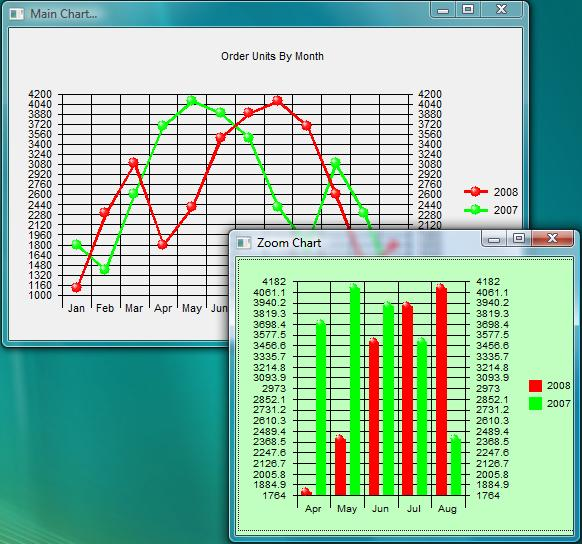



## MSChart Tricks

### Description

Some ideas when using MSChart in your programs. This program shows you how to add tooltips to MSChart. Increase the chart details when the form is resized and created another chart (zoom chart) by selecting data points from the main chart.
 
### More Info
 
This program was created using MSchart control 6.00.00. If you try to load the forms and get a log error you probably have a different MSChart verison. Simply add your version of MSChart control to the Toolbox and drag it to each form. Fill each form completely with the MSChart control. The code contains the proper settings needed at runtime.

Note: don't resize the forms. You can adjust original form sizes once you dig into the code.

             |
---                |---
**Submitted On**   |2008-04-04 06:51:30
**By**             |[G\. Hennen](https://github.com/Planet-Source-Code/PSCIndex/blob/master/ByAuthor/g-hennen.md)
**Level**          |Intermediate
**User Rating**    |4.2 (21 globes from 5 users)
**Compatibility**  |VB 6\.0
**Category**       |[Miscellaneous](https://github.com/Planet-Source-Code/PSCIndex/blob/master/ByCategory/miscellaneous__1-1.md)
**World**          |[Visual Basic](https://github.com/Planet-Source-Code/PSCIndex/blob/master/ByWorld/visual-basic.md)
**Archive File**   |[MSChart\_Tr210849442008\.zip](https://github.com/Planet-Source-Code/g-hennen-mschart-tricks__1-70368/archive/master.zip)

